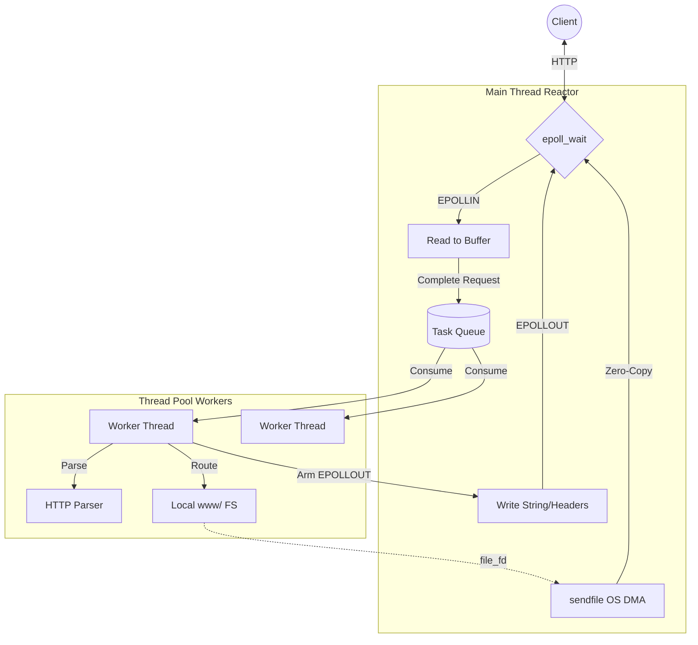

# HTTP Server - Architecture Overview

This server implementation prioritizes maximum single-node throughput for serving static content by minimizing the time spent blocking on I/O operations and avoiding kernel-to-user-space memory copies. 

The core architecture follows the **Reactor Pattern**, decoupled from an arbitrary **Worker Thread Pool**.

## Architecture Diagram

## End-to-End Request Lifecycle

1. **Accept Connection (`epoll` listener)**
   - The main process binds a listening, non-blocking socket to the designated port.
   - It instantiates a Linux `epoll` instance and adds the listening socket to the watch list with the `EPOLLIN` (read ready) and `EPOLLET` (Edge-Triggered) flags.
   - When a client connects, the OS fires an event to `epoll_wait()`. The main thread loops on `accept()` until `EAGAIN` is encountered, assigning each new connection a strongly-typed `Connection` object to track its state, and registers its file descriptor with `epoll` using `EPOLLIN | EPOLLET | EPOLLONESHOT`.

2. **Reading Data (Reactor loop)**
   - The client begins transmitting the HTTP plaintext. `epoll_wait` triggers again.
   - The main thread rapidly reads the data via `read()` into the `Connection`'s input buffer. Because it is edge-triggered, it loops this action without yielding until `EAGAIN` indicates the socket buffer is empty.
   - It checks the input buffer for the end-of-headers byte sequence (`\r\n\r\n`).

3. **ThreadPool Dispatch (`EPOLLONESHOT` Safety)**
   - Because the socket was registered with `EPOLLONESHOT`, traversing `\r\n\r\n` ensures the main `epoll` loop will *not* fire further events for this specific client until it's explicitly re-armed.
   - The `Connection` is pushed to a standard producer-consumer `ThreadPool` protected by a `std::mutex` and `std::condition_variable`.

4. **HTTP Parsing (Worker execution)**
   - One of the `N` background threads wakes up and consumes the `Connection` block from the task queue.
   - It invokes `HttpParser`—a completely zero-dependency, manual extraction layer—to pull the Method (e.g., `GET`), Path (e.g., `/index.html`), and key-value Headers into a structured `HttpRequest` struct.

5. **Static File Routing & Initialization**
   - The Worker determines the valid system path relative to the `www/` sandbox.
   - If the file exists, it opens the file `O_RDONLY`. Crucially, **it does not read the file into memory**. Instead, it populates the `HttpResponse` struct with the physical `file_fd` (File Descriptor) and file size metrics gathered via `fstat`.
   - The Worker packages the HTTP headers (e.g., `HTTP/1.1 200 OK`, `Content-Length: X`), and writes them into the `Connection`'s write buffer.

6. **Re-arming for Write**
   - The worker mutates the `epoll` structure, calling `epoll_ctl` with `EPOLL_CTL_MOD` to change the client connection state to `EPOLLOUT | EPOLLET | EPOLLONESHOT`.
   - The Worker immediately yields and acquires the next request.

7. **Zero-Copy Response Delivery (Reactor loop)**
   - The primary `epoll_wait` loop catches the `EPOLLOUT` flag indicating the client socket is ready to receive data.
   - It first flushes the string headers from the `Connection`'s write buffer natively through `write()`.
   - Then, recognizing `file_fd` is populated, it invokes Linux `sendfile(socket_fd, file_fd)`. 
   - `sendfile` instructs the kernel to DMA the file structure directly from the OS page cache to the Network Interface Card (NIC) buffers. This bypasses the typical roundtrip context-switch copying into user-space entirely (Zero-Copy Transfer).

8. **Teardown**
   - When the `file_offset` tracks total bytes sent correctly, the `file_fd` is closed, and the `Connection` state moves to terminate the socket unless `Keep-Alive` logic determines it should pivot backward to step 2.
